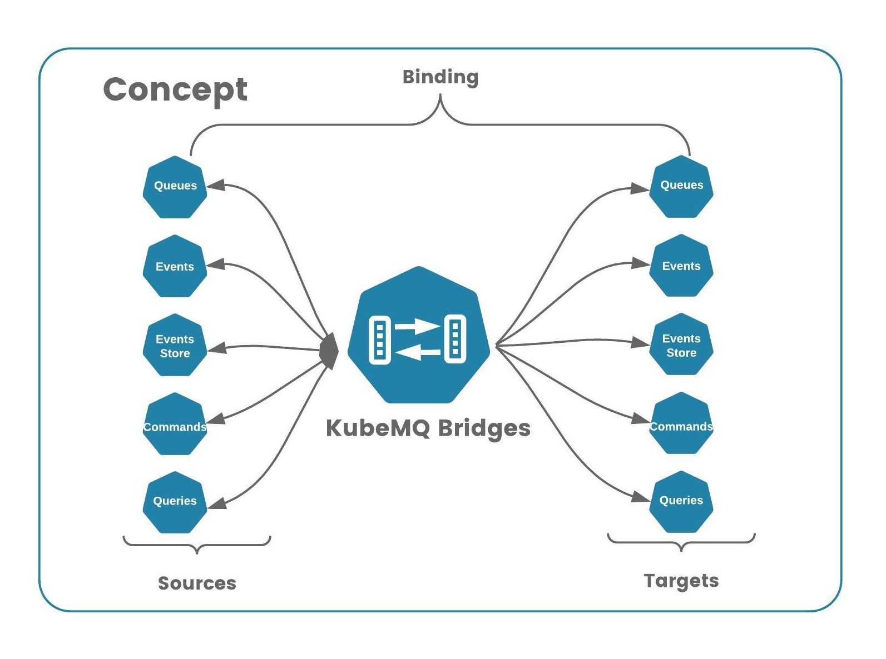
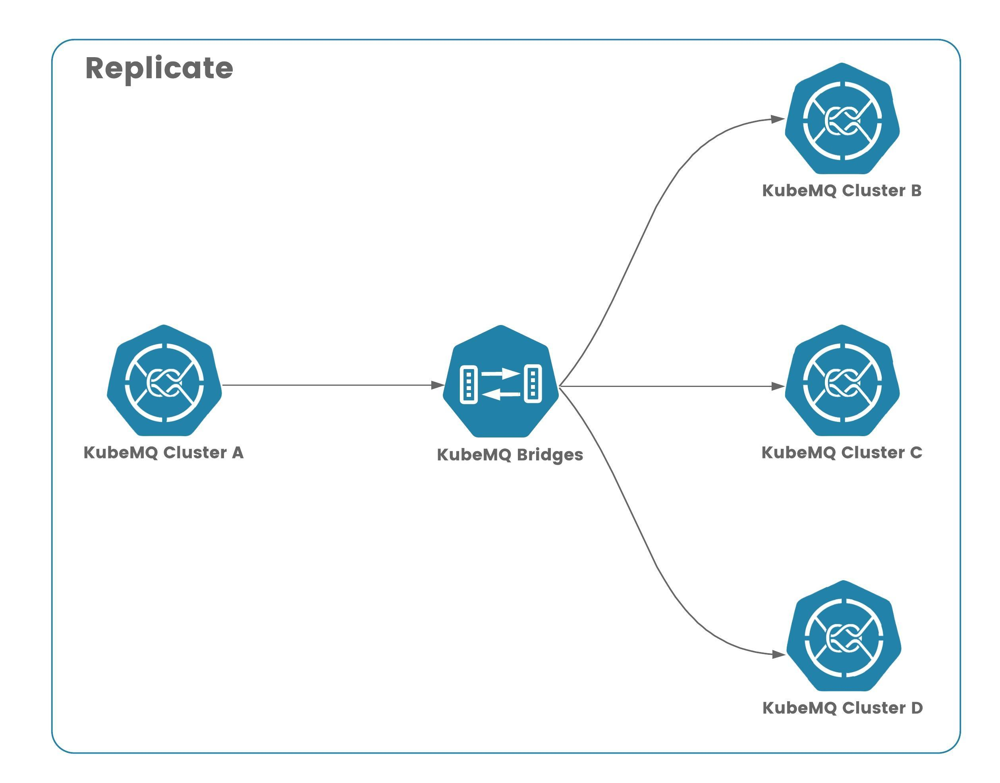
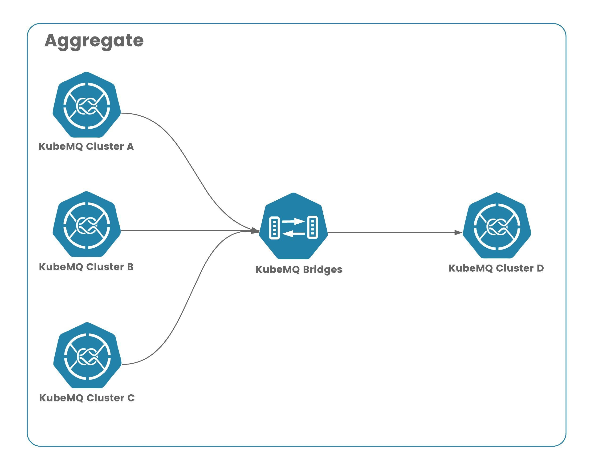
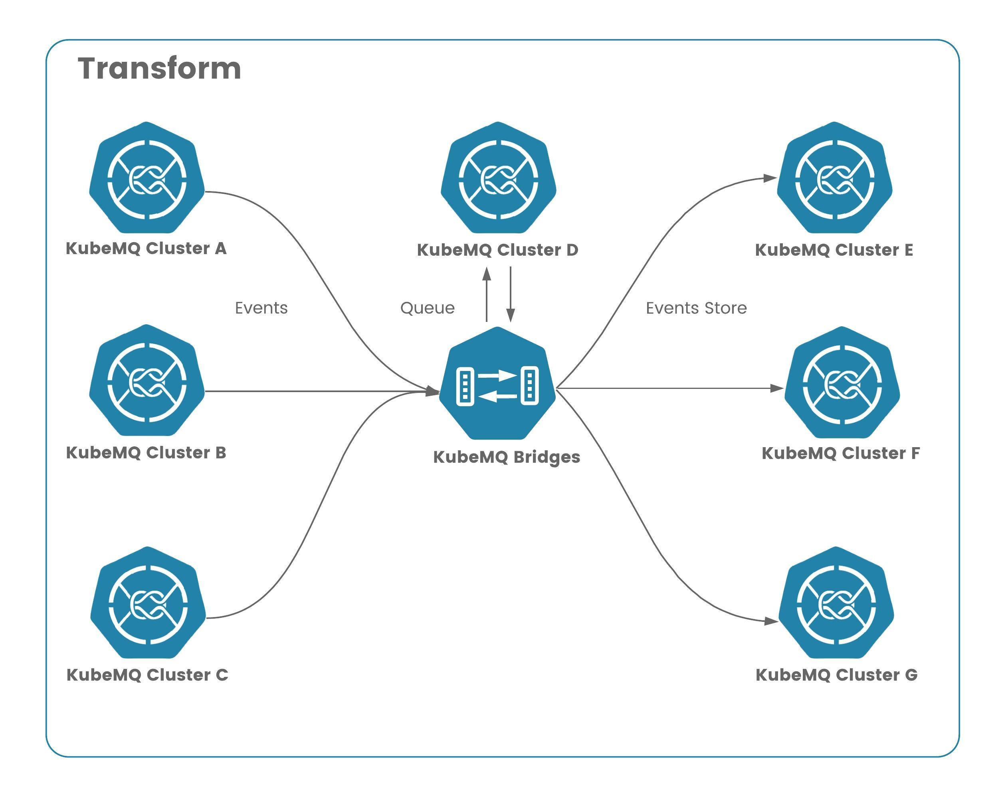

# kubemq-bridges


## Concept




### Bridge


### Replicate



### Aggregate



### Transform



## Installation

### Kubernetes

An example of kubernetes deployment can be find below:
```yaml
---
apiVersion: apps/v1
kind: Deployment
metadata:
  name: kubemq-bridges-deployment
  namespace: kubemq
  labels:
    app: kubemq-bridges
spec:
  replicas: 1
  selector:
    matchLabels:
      app: kubemq-bridges
  template:
    metadata:
      labels:
        app: kubemq-bridges
    spec:
      containers:
        - name: kubemq-bridges
          image: kubemq/kubemq-bridges:latest
          ports:
            - containerPort: 8080
          volumeMounts:
            - mountPath: /kubemq-bridges/config.yaml
              name: config-file
              subPath: config.yaml
      volumes:
        - name: config-file
          configMap:
            name: kubemq-bridges-config
            items:
              - key: config.yaml
                path: config.yaml
---
apiVersion: v1
kind: ConfigMap
metadata:
  name: kubemq-bridges-config
  namespace: kubemq
data:
  config.yaml: |-
    apiPort: 8080
    bindings:
      - name: clusters-sources
        properties:
          log_level: "debug"
        sources:
          kind: source.query
          name: cluster-a-query-source
          connections:
            - address: "kubemq-cluster-a-grpc.kubemq.svc.cluster.local:50000"
              client_id: "cluster-a-query-source"
              auth_token: ""
              channel: "queries"
              group:   ""
              auto_reconnect: "true"
              reconnect_interval_seconds: "1"
              max_reconnects: "0"
        targets:
          kind: target.query
          name: cluster-targets
          connections:
            - address: "kubemq-cluster-b-grpc.kubemq.svc.cluster.local:50000"
              client_id: "cluster-b-query-target"
              auth_token: ""
              default_channel: "queries"
              timeout_seconds: 3600
            - address: "kubemq-cluster-c-grpc.kubemq.svc.cluster.local:50000"
              client_id: "cluster-c-query-target"
              auth_token: ""
              default_channel: "queries"
              timeout_seconds: 3600
            - address: "kubemq-cluster-d-grpc.kubemq.svc.cluster.local:50000"
              client_id: "cluster-d-query-target"
              auth_token: ""
              default_channel: "queries"
              timeout_seconds: 3600
```

## Configuration

### Config file

KubeMQ Bridges loads configuration on startup. Configuration file is a yaml file contains definitions for bindings of Sources and Targets.

Default config file name is config.yaml and KubeMQ bridges search for this file on loading.

#### Structure

Config file structure:

```yaml

apiPort: 8080 # kubemq bridges api and health end-point port
bindings:
  - name: clusters-sources # unique binding name
    properties: # Bindings properties such middleware configurations
      log_level: error
      retry_attempts: 3
      retry_delay_milliseconds: 1000
      retry_max_jitter_milliseconds: 100
      retry_delay_type: "back-off"
      rate_per_second: 100
    sources:
      kind: source.query # Sources kind
      name: name-of-sources # sources name 
      connections: # Array of connections settings per each source kind
        - .....
    targets:
      kind: target.query # Targets kind
      name: name-of-targets # targets name
      connections: # Array of connections settings per each target kind
        - .....
```

### Properties

In bindings configuration, KubeMQ Bridges supports properties setting for each pair of source and target bindings.

These properties contains middleware information settings as follows:

#### Logs Middleware

KubeMQ Bridges supports level based logging to console according as follows:

| Property  | Description       | Possible Values        |
|:----------|:------------------|:-----------------------|
| log_level | log level setting | "debug","info","error" |
|           |                   |  "" - indicate no logging on this bindings |

An example for only error level log to console:

```yaml
bindings:
  - name: sample-binding 
    properties: 
      log_level: error
    sources:
    ......  
```

#### Retry Middleware

KubeMQ Bridges supports Retry target execution before reporting of error back to source on failed execution.

Retry middleware settings values:


| Property                      | Description                                           | Possible Values                             |
|:------------------------------|:------------------------------------------------------|:--------------------------------------------|
| retry_attempts                | how many retries before giving up on target execution | default - 1, or any int number              |
| retry_delay_milliseconds      | how long to wait between retries in milliseconds      | default - 100ms or any int number           |
| retry_max_jitter_milliseconds | max delay jitter between retries                      | default - 100ms or any int number           |
| retry_delay_type              | type of retry delay                                   | "back-off" - delay increase on each attempt |
|                               |                                                       | "fixed" - fixed time delay                  |
|                               |                                                       | "random" - random time delay                |

An example for 3 retries with back-off strategy:

```yaml
bindings:
  - name: sample-binding 
    properties: 
      retry_attempts: 3
      retry_delay_milliseconds: 1000
      retry_max_jitter_milliseconds: 100
      retry_delay_type: "back-off"
    sources:
    ......  
```

#### Rate Limiter Middleware

KubeMQ Bridges supports Rate Limiting of target executions.

Rate Limiter middleware settings values:


| Property        | Description                                    | Possible Values                |
|:----------------|:-----------------------------------------------|:-------------------------------|
| rate_per_second | how many executions per second will be allowed | 0 - no limitation              |
|                 |                                                | 1 - n integer times per second |

An example for 100 executions per second:

```yaml
bindings:
  - name: sample-binding 
    properties: 
      rate_per_second: 100
    sources:
    ......  
```

### Sources

Sources section contains sources configuration for binding as follows:

| Property    | Description                                        | Possible Values                       |
|:------------|:---------------------------------------------------|:--------------------------------------|
| name        | sources name (will show up in logs)                | string without white spaces           |
| kind        | source kind type                                   | source.queue                          |
|             |                                                    | source.query                          |
|             |                                                    | source.command                        |
|             |                                                    | source.events                         |
|             |                                                    | source.events-store                   |
| connections | and array of connection properties for each source | check out sources connections options |

#### Queue Source

Queue source connection settings:

| Property               | Description                                             | Required | Possible Values                                      |
|:-----------------------|:--------------------------------------------------------|:---------|:-----------------------------------------------------|
| address                | kubemq server address (gRPC interface)                  | yes      | kubemq-cluster-a-grpc.kubemq.svc.cluster.local:50000 |
| client_id             |  sets client_id value for connection           | no       | "cluster-a-queue-connection"                                            |
| auth_token             | JWT auth token for connection authentication            | no       | jwt token                                            |
| channel                | kubemq channel to pull queue messages                   | yes      | queue.a                                              |
| batch_size             | sets how many messages the source will pull in one call | no       | default - 1                                          |
| wait_timeout           | sets how many seconds to wait per each pull             | no       | 60                                                   |

An example for queue source:

```yaml
bindings:
  - name:  queue-binding 
    properties: 
      log_level: error
      retry_attempts: 3
      retry_delay_milliseconds: 1000
      retry_max_jitter_milliseconds: 100
      retry_delay_type: "back-off"
      rate_per_second: 100
    sources:
      kind: source.queue # Sources kind
      name: 3-clusters-source # sources name 
      connections: # Array of connections settings per each source kind
        - address: "kubemq-cluster-a-grpc.kubemq.svc.cluster.local:50000"
          client_id: "cluster-a-queue-connection"
          auth_token: ""
          channel: "queue"
          batch_size: 1
          wait_timeout: 60
        - address: "kubemq-cluster-b-grpc.kubemq.svc.cluster.local:50000"
          client_id: "cluster-b-queue-connection"
          auth_token: ""
          channel: "queue"
          batch_size: 1
          wait_timeout: 60
        - address: "kubemq-cluster-c-grpc.kubemq.svc.cluster.local:50000"
          client_id: "cluster-c-queue-connection"
          auth_token: ""
          channel: "queue"
          batch_size: 1
          wait_timeout: 60    
    targets:
    .....
```


