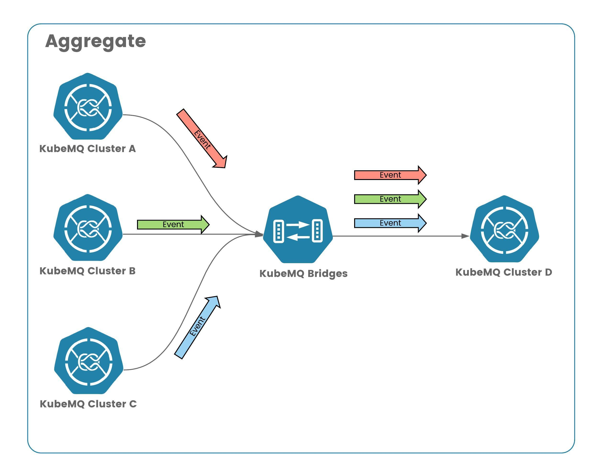

# KubeMQ Bridges - Aggregate Example

In this example we demonstrate how to aggregate data from multiple clusters as sources (in this case events) and send all the events to single cluster as targets for further processing.



## Configuration

### KubeMQ Bridges Configuration
```yaml
apiPort: 8081
bindings:
  - name: cluster-a-d-events
    source:
      kind: source.events
      name: cluster-a-events-source
      properties:
        address: "localhost:30501"
        client_id: "cluster-a-events-source"
        auth_token: ""
        channel: "events.a"
        group:   ""
        concurrency: "1"
        auto_reconnect: "true"
        reconnect_interval_seconds: "1"
        max_reconnects: "0"
    target:
      kind: target.events
      name: cluster-a-d-events-target
      properties:
        address: "localhost:30504"
        client_id: "cluster-a-d-events-target"
        auth_token: ""
        channels: "events.aggregate"
    properties:
      log_level: "debug"
  - name: cluster-b-d-events
    source:
      kind: source.events
      name: cluster-b-events-source
      properties:
        address: "localhost:30502"
        client_id: "cluster-b-events-source"
        auth_token: ""
        channel: "events.b"
        group:   ""
        concurrency: "1"
        auto_reconnect: "true"
        reconnect_interval_seconds: "1"
        max_reconnects: "0"
    target:
      kind: target.events
      name: cluster-b-d-events-target
      properties:
        address: "localhost:30504"
        client_id: "cluster-b-d-events-target"
        auth_token: ""
        channels: "events.aggregate"
    properties:
      log_level: "debug"
  - name: cluster-c-d-events
    source:
      kind: source.events
      name: cluster-c-events-source
      properties:
        address: "localhost:30503"
        client_id: "cluster-c-d-events-source"
        auth_token: ""
        channel: "events.c"
        group:   ""
        concurrency: "1"
        auto_reconnect: "true"
        reconnect_interval_seconds: "1"
        max_reconnects: "0"
    target:
      kind: target.events
      name: cluster-c-d-events-target
      properties:
        address: "localhost:30504"
        client_id: "cluster-c-d-events-target"
        auth_token: ""
        channels: "events.aggregate"
    properties:
      log_level: "debug" 
```

### KubeMQ clusters configuration

```yaml
apiVersion: core.k8s.kubemq.io/v1alpha1
kind: KubemqCluster
metadata:
  name: kubemq-cluster-a
  namespace: kubemq
spec:
  replicas: 3
  grpc:
    expose: NodePort
    nodePort: 30501
---
apiVersion: core.k8s.kubemq.io/v1alpha1
kind: KubemqCluster
metadata:
  name: kubemq-cluster-b
  namespace: kubemq
spec:
  replicas: 3
  grpc:
    expose: NodePort
    nodePort: 30502
---
apiVersion: core.k8s.kubemq.io/v1alpha1
kind: KubemqCluster
metadata:
  name: kubemq-cluster-c
  namespace: kubemq
spec:
  replicas: 3
  grpc:
    expose: NodePort
    nodePort: 30503
---
apiVersion: core.k8s.kubemq.io/v1alpha1
kind: KubemqCluster
metadata:
  name: kubemq-cluster-d
  namespace: kubemq
spec:
  replicas: 3
  grpc:
    expose: NodePort
    nodePort: 30504
```

