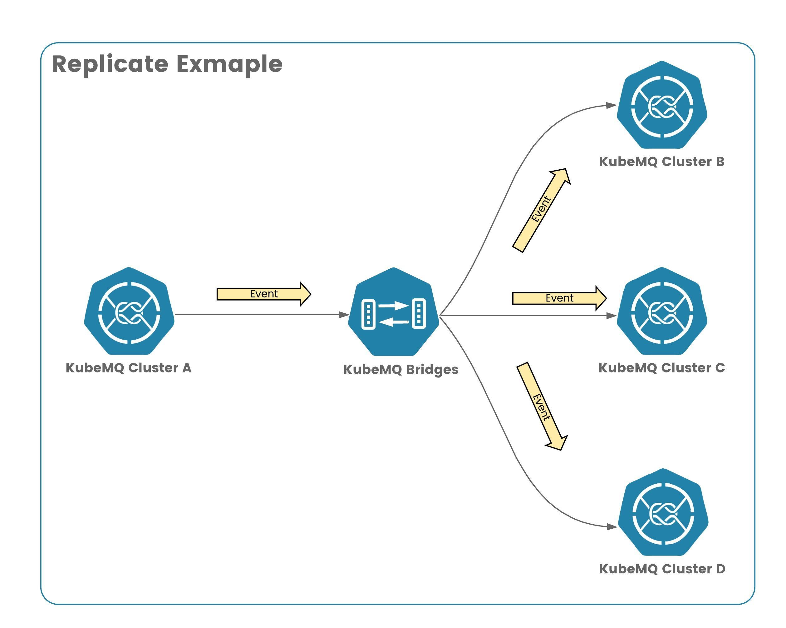

# KubeMQ Bridges - Replicate Example

In this example we demonstrate how to replicate messages from one cluster as source to multiple clusters as targets.



## Run

Run the following deployment

```bash
kubectl apply -f ./deploy.yaml
```
Where deploy.yaml:

```yaml
apiVersion: core.k8s.kubemq.io/v1alpha1
kind: KubemqCluster
metadata:
  name: kubemq-cluster-a
  namespace: kubemq
spec:
  replicas: 3
  grpc:
    expose: NodePort
    nodePort: 30501
---
apiVersion: core.k8s.kubemq.io/v1alpha1
kind: KubemqCluster
metadata:
  name: kubemq-cluster-b
  namespace: kubemq
spec:
  replicas: 3
  grpc:
    expose: NodePort
    nodePort: 30502
---
apiVersion: core.k8s.kubemq.io/v1alpha1
kind: KubemqCluster
metadata:
  name: kubemq-cluster-c
  namespace: kubemq
spec:
  replicas: 3
  grpc:
    expose: NodePort
    nodePort: 30503
---
apiVersion: core.k8s.kubemq.io/v1alpha1
kind: KubemqCluster
metadata:
  name: kubemq-cluster-d
  namespace: kubemq
spec:
  replicas: 3
  grpc:
    expose: NodePort
    nodePort: 30504
---
apiVersion: apps/v1
kind: Deployment
metadata:
  name: kubemq-bridges-deployment
  namespace: kubemq
  labels:
    app: kubemq-bridges
spec:
  replicas: 1
  selector:
    matchLabels:
      app: kubemq-bridges
  template:
    metadata:
      labels:
        app: kubemq-bridges
    spec:
      containers:
        - name: kubemq-bridges
          image: kubemq/kubemq-bridges:latest
          ports:
            - containerPort: 8080
          volumeMounts:
            - mountPath: /kubemq-bridges/config.yaml
              name: config-file
              subPath: config.yaml
      volumes:
        - name: config-file
          configMap:
            name: kubemq-bridges-config
            items:
              - key: config.yaml
                path: config.yaml
---
apiVersion: v1
kind: ConfigMap
metadata:
  name: kubemq-bridges-config
  namespace: kubemq
data:
  config.yaml: |-
    apiPort: 8081
    bindings:
      - name: cluster-sources
        properties:
          log_level: "debug"
        sources:
          kind: source.events
          name: cluster-a-events-source
          connections:
            - address: "kubemq-cluster-a-grpc.kubemq.svc.cluster.local:50000"
              client_id: "cluster-a-events-source"
              auth_token: ""
              channel: "events"
              group:   ""
              auto_reconnect: "true"
              reconnect_interval_seconds: "1"
              max_reconnects: "0"
        targets:
          kind: target.events
          name: cluster-targets
          connections:
            - address: "kubemq-cluster-b-grpc.kubemq.svc.cluster.local:50000"
              client_id: "cluster-b-events-target"
              auth_token: ""
              channels: "events.b.1,events.b.2"
            - address: "kubemq-cluster-c-grpc.kubemq.svc.cluster.local:50000"
              client_id: "cluster-c-events-target"
              auth_token: ""
              channels: "events.c.1,events.c.2"
            - address: "kubemq-cluster-d-grpc.kubemq.svc.cluster.local:50000"
              client_id: "cluster-d-events-target"
              auth_token: ""
              channels: "events.d.1,events.d.2"

```

