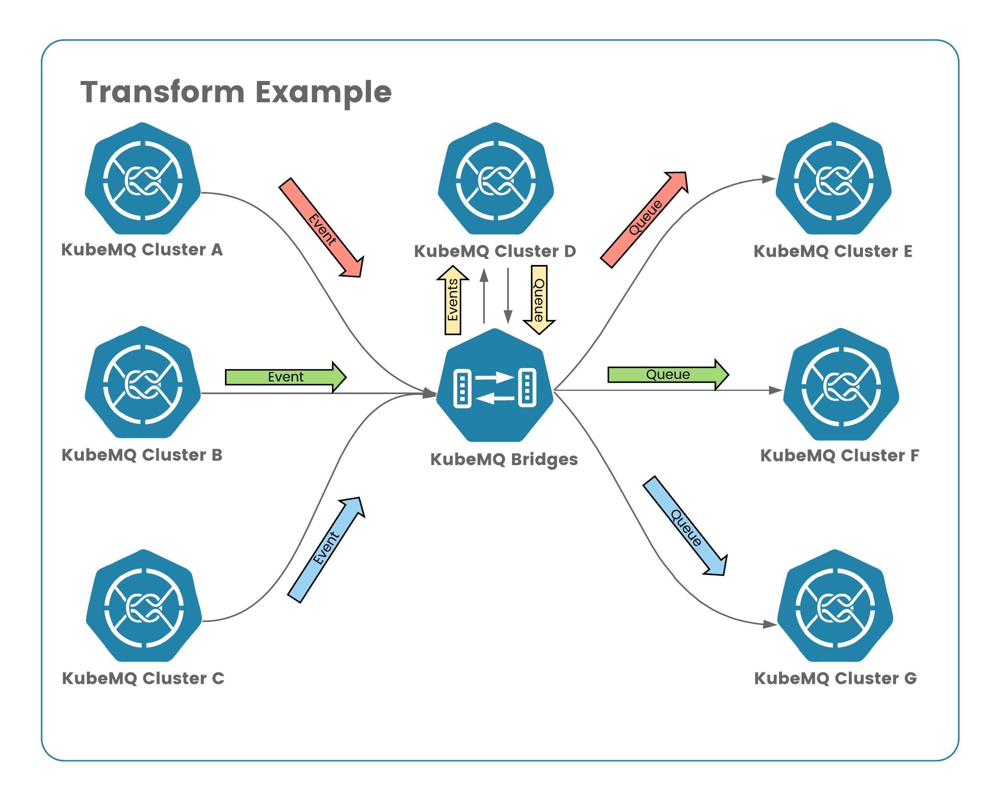

# KubeMQ Bridges - Transform Example

In this example we demonstrate how to transform and aggregating of events in one cluster and replicate them as qeuue messages to other clusters.



## Run

Run the following deployment

```bash
kubectl apply -f ./deploy.yaml
```
Where deploy.yaml:

```yaml
apiVersion: core.k8s.kubemq.io/v1alpha1
kind: KubemqCluster
metadata:
  name: kubemq-cluster-a
  namespace: kubemq
spec:
  replicas: 3
  grpc:
    expose: NodePort
    nodePort: 30501
---
apiVersion: core.k8s.kubemq.io/v1alpha1
kind: KubemqCluster
metadata:
  name: kubemq-cluster-b
  namespace: kubemq
spec:
  replicas: 3
  grpc:
    expose: NodePort
    nodePort: 30502
---
apiVersion: core.k8s.kubemq.io/v1alpha1
kind: KubemqCluster
metadata:
  name: kubemq-cluster-c
  namespace: kubemq
spec:
  replicas: 3
  grpc:
    expose: NodePort
    nodePort: 30503
---
apiVersion: core.k8s.kubemq.io/v1alpha1
kind: KubemqCluster
metadata:
  name: kubemq-cluster-d
  namespace: kubemq
spec:
  replicas: 3
  grpc:
    expose: NodePort
    nodePort: 30504
---
apiVersion: core.k8s.kubemq.io/v1alpha1
kind: KubemqCluster
metadata:
  name: kubemq-cluster-e
  namespace: kubemq
spec:
  replicas: 3
  grpc:
    expose: NodePort
    nodePort: 30505
---
apiVersion: core.k8s.kubemq.io/v1alpha1
kind: KubemqCluster
metadata:
  name: kubemq-cluster-f
  namespace: kubemq
spec:
  replicas: 3
  grpc:
    expose: NodePort
    nodePort: 30506
---
apiVersion: core.k8s.kubemq.io/v1alpha1
kind: KubemqCluster
metadata:
  name: kubemq-cluster-g
  namespace: kubemq
spec:
  replicas: 3
  grpc:
    expose: NodePort
    nodePort: 30507
---
apiVersion: apps/v1
kind: Deployment
metadata:
  name: kubemq-bridges-deployment
  namespace: kubemq
  labels:
    app: kubemq-bridges
spec:
  replicas: 1
  selector:
    matchLabels:
      app: kubemq-bridges
  template:
    metadata:
      labels:
        app: kubemq-bridges
    spec:
      containers:
        - name: kubemq-bridges
          image: kubemq/kubemq-bridges:latest
          ports:
            - containerPort: 8080
          volumeMounts:
            - mountPath: /kubemq-bridges/config.yaml
              name: config-file
              subPath: config.yaml
      volumes:
        - name: config-file
          configMap:
            name: kubemq-bridges-config
            items:
              - key: config.yaml
                path: config.yaml
---
apiVersion: core.k8s.kubemq.io/v1alpha1
kind: KubemqConnector
metadata:
  name: kubemq-bridges
  namespace: kubemq
spec:
  type: bridges
  replicas: 1
  image: kubemq/kubemq-bridges:latest
  config: |-
    bindings:
    - name: clusters-sources
      properties:
        log_level: "debug"
      sources:
        kind: source.queue
        connections:
          - address: "kubemq-cluster-a-grpc.kubemq.svc.cluster.local:50000"
            channel: "queue1"          
          - address: "kubemq-cluster-b-grpc.kubemq.svc.cluster.local:50000"
            channel: "queue1"
      targets:
        kind: target.queue
        name: cluster-targets
        connections:
          - address: "kubemq-cluster-c-grpc.kubemq.svc.cluster.local:50000"
            channels: "queue1"
          - address: "kubemq-cluster-d-grpc.kubemq.svc.cluster.local:50000"
            channels: "queue1"
```

